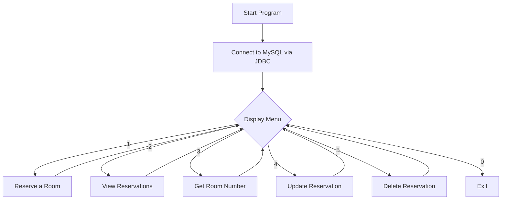

<div align="center">

# 🏨 Hotel Reservation System

### A console-based Hotel Management System built with **Java** & **MySQL**

[](https://www.java.com/)
[](https://www.mysql.com/)
[](https://www.jetbrains.com/idea/)
[](https://dev.mysql.com/downloads/connector/j/)

[](LICENSE)


**A simple, beginner-friendly CRUD application that manages hotel room reservations from the command line — built to learn and demonstrate core Java, JDBC, and SQL fundamentals.**

[Features](#-features) •
[Demo](#-demo) •
[Getting Started](#-getting-started) •
[Database Setup](#-database-setup) •
[Project Structure](#-project-structure) •
[Roadmap](#-roadmap)

</div>

---

## 📖 About the Project

The **Hotel Reservation System** is a Java console application that lets a hotel front-desk operator **create, view, search, update, and delete room reservations** stored in a MySQL database. It was built as a hands-on project to practice **JDBC database connectivity**, **CRUD operations**, and **menu-driven program design** in pure Java — no frameworks, no fluff.

> 💡 Think of it as a digital register for a small hotel — fast, lightweight, and runs entirely in the terminal.

---

## ✨ Features

| # | Feature | Description |
|---|----------|-------------|
| 🛏️ | **Reserve a Room** | Book a room by entering guest name, room number, and contact number |
| 📋 | **View Reservations** | Display all current reservations in a clean, formatted table |
| 🔍 | **Get Room Number** | Look up a guest's room number using their reservation ID + name |
| ✏️ | **Update Reservation** | Modify guest details on an existing reservation |
| 🗑️ | **Delete Reservation** | Remove a reservation record from the system |
| 🔌 | **Live MySQL Integration** | All data is persisted in a real MySQL database via JDBC |

---

## 🎬 Demo

```
HOTEL MANAGEMENT SYSTEM
1. Reserve a room
2. View Reservations
3. Get Room Number
4. Update Reservations
5. Delete Reservations
0. Exit
Choose an option: 1

Enter guest name: Ali Khan
Enter room number: 204
Enter contact number: 03001234567
Reservation successful!
```

```
Current Reservations:
+----------------+-----------------+---------------+----------------------+-------------------------+
| Reservation ID | Guest           | Room Number   | Contact Number      | Reservation Date        |
+----------------+-----------------+---------------+----------------------+-------------------------+
| 1              | Ali Khan        | 204           | 03001234567          | 2026-06-25 14:32:10     |
+----------------+-----------------+---------------+----------------------+-------------------------+
```

---

## 🛠️ Tech Stack

- **Language:** Java (JDK 8+)
- **Database:** MySQL
- **Connectivity:** JDBC — `mysql-connector-j-9.2.0`
- **IDE:** IntelliJ IDEA
- **Interface:** Command-line (Scanner-based menu)

---

## 🚀 Getting Started

### Prerequisites

Make sure you have these installed before running the project:

- ☕ [JDK 8 or higher](https://www.oracle.com/java/technologies/downloads/)
- 🐬 [MySQL Server](https://dev.mysql.com/downloads/mysql/)
- 🧩 [MySQL Connector/J 9.2.0](https://dev.mysql.com/downloads/connector/j/) (JDBC driver `.jar`)
- 💻 [IntelliJ IDEA](https://www.jetbrains.com/idea/) (recommended) or any Java IDE

### Installation

1. **Clone the repository**
   ```bash
   git clone https://github.com/<your-username>/Hotel_Management_System.git
   cd Hotel_Management_System
   ```

2. **Add the MySQL Connector/J jar**
   Download `mysql-connector-j-9.2.0.jar` and add it as a library in your IDE
   (IntelliJ: `File → Project Structure → Libraries → + → Java`)

3. **Set up the database** — see [Database Setup](#-database-setup) below

4. **Configure credentials**
   Open `src/HotelReservationSystem.java` and update these constants to match your local setup:
   ```java
   private static final String url = "jdbc:mysql://localhost:3306/Hotel_db";
   private static final String username = "root";
   private static final String password = "1234";
   ```

5. **Run the application**
   ```bash
   javac src/HotelReservationSystem.java -cp mysql-connector-j-9.2.0.jar
   java -cp .:mysql-connector-j-9.2.0.jar src.HotelReservationSystem
   ```
   *(or simply hit ▶ Run inside IntelliJ IDEA)*

---

## 🗄️ Database Setup

Create the database and table using the SQL below:

```sql
CREATE DATABASE IF NOT EXISTS Hotel_db;
USE Hotel_db;

CREATE TABLE reservations (
    reservation_id   INT AUTO_INCREMENT PRIMARY KEY,
    guest_name       VARCHAR(100) NOT NULL,
    room_number      INT NOT NULL,
    contact_number   VARCHAR(20) NOT NULL,
    reservation_date TIMESTAMP DEFAULT CURRENT_TIMESTAMP
);
```

---

## 📂 Project Structure

```
Hotel_Management_System/
├── src/
│   └── HotelReservationSystem.java   # Main application logic (menu, CRUD operations)
├── out/
│   └── production/                   # Compiled .class output (IntelliJ build)
└── Hotel_Management_System.iml       # IntelliJ project module file
```

---

## 🧭 How It Works



---

## 🧩 Roadmap / Future Improvements

This project is intentionally simple — here's what could take it further:

- [ ] Replace string-concatenated SQL with **PreparedStatement** to prevent SQL injection
- [ ] Move DB credentials to a config file / environment variables instead of hardcoding
- [ ] Add input validation (e.g., reject non-numeric room numbers gracefully)
- [ ] Add room availability tracking (mark rooms as booked/available)
- [ ] Add billing & checkout functionality
- [ ] Build a GUI (JavaFX or Swing) or a web frontend
- [ ] Add unit tests (JUnit)

> Contributions and suggestions are welcome — feel free to open an issue or PR! 🙌

---

## 🤝 Contributing

1. Fork the repo
2. Create your feature branch (`git checkout -b feature/amazing-feature`)
3. Commit your changes (`git commit -m 'Add some amazing feature'`)
4. Push to the branch (`git push origin feature/amazing-feature`)
5. Open a Pull Request

---

## 📄 License

This project is licensed under the **MIT License** — feel free to use, modify, and distribute it.

---

## 👤 Author

**Deepak**
🔗 [GitHub](https://github.com/DeepakGir)) • [LinkedIn](https://linkedin.com/in/your-profile)

---

<div align="center">

⭐ If you found this project useful, consider giving it a **star** — it helps a lot!

</div>
